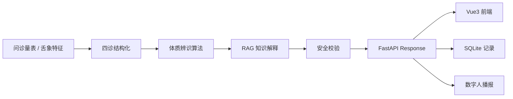
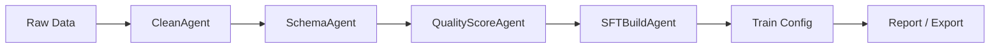

# TCM-Multimodal-Finetune-Agent

> A LangGraph + FastAPI + Vue3 demo for Traditional Chinese Medicine knowledge QA, constitution questionnaire scoring, RAG explanation, dataset governance, fine-tuning preparation, and digital-human result broadcasting.


**项目定位**：本项目是一个面向面试、汇报和工程能力展示的中医 AI Demo，重点展示“数据治理 -> 体质辨识 -> 知识库解释 -> 接口服务 -> 前端展示 -> 数字人播报 -> 微调准备”的工程闭环。

**医学免责声明**：本系统仅用于中医知识检索、体质倾向分析和工程能力展示，不作为临床诊断依据，不提供处方、开药或具体用药建议。任何健康问题请咨询合格医生。

## 项目简介

`TCM-Multimodal-Finetune-Agent` 围绕中医知识库、九种体质辨识、四诊结构化数据、多模态舌象样例、RAG 检索解释、数字人播报和 LoRA/QLoRA 微调准备构建。项目不默认启动真实大模型训练，而是优先保证数据、接口、前端、测试和演示流程稳定可运行。

核心亮点：

- **中医体质问卷闭环**：支持问诊量表、可选舌象上传、四诊结构化、九种体质评分、主倾向体质和兼夹体质输出。
- **RAG 知识解释**：基于本地中医知识库进行检索解释，返回来源、标签、分数和安全提示。
- **LangGraph 数据治理流水线**：用 Agent 编排数据加载、清洗、Schema 校验、质量评分、SFT/MM-SFT 构造和报告导出。
- **FastAPI 第三方接口**：暴露健康检查、知识问答、体质辨识、数据集构建、数字人播报和记录查询接口。
- **Vue3 演示前端 + 后台**：主前端展示业务闭环，后台用于查看体质辨识历史记录、四诊结构化数据和统计分析。
- **微调准备能力**：生成 Alpaca SFT 数据、LLaMA-Factory 数据集配置、LoRA/QLoRA 配置和模拟训练日志，后续可接入真实训练。

## Demo Preview

> 以下截图位为 GitHub 展示预留，可在本地启动前端后替换为真实截图。

| 页面 | 说明 | 截图 |
| --- | --- | --- |
| 首页 / 系统概览 | 展示四层架构和业务流程链路 | `docs/assets/home-preview.png` |
| 体质辨识问卷 | 问诊量表、舌象上传、四诊结构化、九种体质评分 | `docs/assets/questionnaire-preview.png` |
| 中医知识问答 | RAG 检索解释、来源引用、标签和分数 | `docs/assets/knowledge-preview.png` |
| 数字人播报 | Web3D 形象、TTS 或字幕 fallback 播报结果 | `docs/assets/digital-human-preview.png` |
| 数据记录后台 | 历史记录、体质分布、四诊数据和播报文本追踪 | `docs/assets/admin-preview.png` |

## 核心功能

| 模块 | 能力 | 说明 |
| --- | --- | --- |
| 体质辨识问卷 | 问诊量表、舌象上传、四诊结构化 | 将用户回答和舌象描述转换为结构化四诊数据 |
| 九种体质评分 | 平和质、气虚质、阳虚质、阴虚质、痰湿质、湿热质、血瘀质、气郁质、特禀质 | 输出各体质分数、主倾向体质和兼夹体质 |
| 知识库问答 | RAG 检索、来源引用、调养建议 | 用本地知识库解释体质含义、常见表现和注意事项 |
| 安全策略 | 高风险意图识别、免责声明 | 对确诊、处方、开药等请求进行安全边界提示 |
| 数字人播报 | Web3D 展示、TTS、字幕 fallback | 接收体质辨识结果和知识库解释文本并进行播报 |
| 数据治理 | LangGraph Agent 流水线 | 构造 SFT、MM-SFT、报告和微调配置 |
| 微调准备 | LoRA/QLoRA 配置、LLaMA-Factory 数据配置 | 默认不执行真实训练，可通过 CLI 进入真实训练流程 |
| 记录后台 | SQLite 记录、统计分析、详情查看 | 追踪体质辨识历史、四诊结构化数据和播报文本 |

## 系统架构

### 推理与演示链路



### 数据集治理与微调准备



## 技术栈

| 层级 | 技术 |
| --- | --- |
| Backend | Python 3.10+, FastAPI, Pydantic, SQLite |
| Agent Workflow | LangGraph, Dataset Agents, Inference Agents, Eval Agents |
| RAG | 本地知识库、关键词检索、轻量向量索引、可替换向量数据库 |
| Frontend | Vue3, Vite, TypeScript, Element Plus |
| Demo UI | Streamlit 可视化演示页 |
| Fine-tuning | Alpaca JSONL, LoRA/QLoRA config, LLaMA-Factory adapter-ready workflow |
| Digital Human | Web3D 前端展示、edge-tts、字幕 fallback |
| Testing | pytest, FastAPI TestClient |

## 项目结构

```text
TCM-Multimodal-Finetune-Agent/
├── app/
│   ├── agents/                 # dataset / inference / eval agents
│   ├── api/routes/             # FastAPI route modules
│   ├── core/                   # paths, response helpers, questionnaire scale items
│   ├── db/                     # SQLite initialization and models
│   ├── graphs/                 # LangGraph dataset and inference workflows
│   ├── repositories/           # record persistence layer
│   ├── schemas/                # request / response schemas
│   ├── scripts/                # vector index utility
│   ├── services/               # RAG, scoring, TTS, dataset, digital human services
│   ├── cli.py                  # project CLI
│   └── main.py                 # main FastAPI entrypoint
├── configs/                    # LLaMA-Factory compatible training configs
├── data/
│   ├── raw/                    # built-in demo jsonl data
│   ├── processed/              # generated SFT / MM-SFT / dataset_info
│   ├── eval/                   # evaluation samples
│   ├── reports/                # dataset and preparation reports
│   ├── vector_store/           # runtime vector index artifact, gitignored
│   └── app.db                  # runtime SQLite database, gitignored
├── docs/                       # setup, digital human, training and dataset docs
├── finetune/                   # demo LoRA / QLoRA yaml and mock train log
├── frontend/                   # Vue3 main frontend and admin mode frontend
├── reports/                    # runtime training / eval reports
├── scripts/                    # dataset inspection, preparation and training helpers
├── tests/                      # pytest tests
├── streamlit_app.py            # Streamlit demo wrapper
└── requirements.txt
```

## 快速开始

### 1. 克隆项目

```bash
git clone <your-repo-url>
cd TCM-Multimodal-Finetune-Agent
```

### 2. 创建 Python 环境

```bash
python -m venv .venv
.venv\Scripts\activate
pip install -r requirements.txt
```

### 3. 构建 Demo 数据与知识库索引

```bash
python -m app.cli dataset build --train-mode safe
python -m app.scripts.build_vector_index
```

说明：

- `dataset build` 会基于 `data/raw/` 中的 demo 数据生成 SFT、MM-SFT、报告和微调配置。
- 如果你已经用 `scripts/prepare_tcm_dataset_sft.py` 生成了外部开源 SFT smoke 数据，重新执行 demo 数据集构建可能覆盖 `data/processed/sft_train.jsonl`，请先备份或按文档选择对应流程。

### 4. 启动 FastAPI 后端

```bash
uvicorn app.main:app --host 127.0.0.1 --port 8010 --reload
```

访问接口文档：

```text
http://127.0.0.1:8010/docs
```

### 5. 启动 Vue3 主前端

```bash
cd frontend
npm install
npm run dev
```

访问：

```text
http://127.0.0.1:5173
```

### 6. 启动 Vue3 数据记录后台

```bash
cd frontend
npm run dev:admin
```

访问：

```text
http://127.0.0.1:5175
```

### 7. 可选启动 Streamlit 演示页

```bash
streamlit run streamlit_app.py
```

访问：

```text
http://localhost:8501
```

### 8. 运行测试

```bash
python -m pytest -q
```

也可以先运行核心闭环测试：

```bash
python -m pytest tests/test_constitution_minimum_loop.py tests/test_vector_rag.py tests/test_sqlite_constitution_records.py -q
```

## 页面入口

| 页面 | 地址 | 说明 |
| --- | --- | --- |
| FastAPI Docs | `http://127.0.0.1:8010/docs` | 后端 OpenAPI 文档 |
| Vue3 主前端 | `http://127.0.0.1:5173` | 首页、体质问卷、知识问答、数字人播报、数据集与微调、评估报告 |
| Vue3 后台 | `http://127.0.0.1:5175` | 体质辨识历史记录与分析后台 |
| Streamlit Demo | `http://localhost:8501` | 轻量可视化演示页面 |

## API 示例

### 健康检查

```bash
curl http://127.0.0.1:8010/api/v1/health
```

### 中医知识问答

```bash
curl -X POST http://127.0.0.1:8010/api/v1/knowledge/ask ^
  -H "Content-Type: application/json; charset=utf-8" ^
  -d "{\"query\":\"气虚质有什么常见表现？\",\"top_k\":3}"
```

### 获取体质问卷

```bash
curl http://127.0.0.1:8010/api/v1/constitution/questionnaire
```

### 提交体质辨识问卷

```bash
curl -X POST http://127.0.0.1:8010/api/v1/constitution/questionnaire/submit ^
  -H "Content-Type: application/json; charset=utf-8" ^
  -d "{\"answers\":{\"fatigue\":4,\"shortness_of_breath\":4,\"spontaneous_sweating\":3},\"tongue\":{\"tongue_color\":\"淡\",\"teeth_marks\":true}}"
```

### 完整体质辨识推理

```bash
curl -X POST http://127.0.0.1:8010/api/v1/constitution/full-infer ^
  -H "Content-Type: application/json; charset=utf-8" ^
  -d "{\"answers\":{\"fatigue\":4,\"shortness_of_breath\":4},\"tongue\":{\"tongue_color\":\"淡\",\"teeth_marks\":true},\"top_k\":3}"
```

### 查询体质辨识记录

```bash
curl "http://127.0.0.1:8010/api/v1/constitution/records?limit=10&offset=0"
```

### 数字人播报

```bash
curl -X POST http://127.0.0.1:8010/api/v1/digital-human/speak ^
  -H "Content-Type: application/json; charset=utf-8" ^
  -d "{\"text\":\"您的体质倾向为气虚质。请注意休息，避免过度劳累。\"}"
```

## LangGraph 工作流

### Dataset Graph

位置：`app/graphs/dataset_graph.py`、`app/agents/dataset_agents.py`

| Agent | 职责 |
| --- | --- |
| DataLoadAgent | 读取 `data/raw/` 内置 demo jsonl 数据 |
| CleanAgent | 清洗空字段、异常字段和基础格式问题 |
| SchemaAgent | 统一中医知识、体质样例、多模态舌象样例 schema |
| QualityScoreAgent | 计算数据质量分和统计信息 |
| SFTBuildAgent | 构造 Alpaca 风格 SFT 数据 |
| MMBuildAgent | 构造包含舌象描述和占位图片路径的 MM-SFT 数据 |
| ExportAgent | 导出 `sft_train.jsonl`、`mm_sft_train.jsonl` 和报告 |

### Inference Graph

位置：`app/graphs/inference_graph.py`、`app/agents/inference_agents.py`

| Agent | 职责 |
| --- | --- |
| RequestValidateAgent | 校验输入并识别高风险请求 |
| SymptomExtractAgent | 从开放式文本中提取症状、舌象和关键词 |
| RAGRetrieveAgent | 检索相关中医知识条目 |
| ConstitutionJudgeAgent | 给出体质倾向判断 |
| SafetyAgent | 对确诊、开药、处方等请求进行安全拒答或风险提示 |
| ResponseFormatAgent | 输出统一响应结构、证据和免责声明 |

说明：当前主业务体质问卷链路主要由 `app/services/constitution_scale_service.py` 和相关 API 路由承载；LangGraph Inference Graph 保留为开放式文本推理 Demo 和工程编排展示。

## 数据与微调

### 内置 Demo 数据

项目在 `data/raw/` 内置少量 demo jsonl 数据，覆盖：

- 中医知识库数据
- 体质辨识样例
- 多模态舌象样例，图片使用占位路径，并包含 `image_description` 字段

构建后生成：

```text
data/processed/sft_train.jsonl
data/processed/mm_sft_train.jsonl
data/processed/dataset_info.json
data/reports/dataset_report.json
```

### 开源中医 SFT 数据准备

如果本地存在外部 parquet 数据：

```text
data/external/TCM-Dataset-SFT/train/*.parquet
```

可以先做检查和抽样转换：

```bash
python scripts/inspect_tcm_dataset.py
python scripts/prepare_tcm_dataset_sft.py --max-rows 1000 --seed 42
```

更大的训练样本建议逐步扩大：

```bash
python scripts/prepare_tcm_dataset_sft.py --max-rows 10000 --seed 42
```

注意：该外部数据更适合作为“中医知识问答 SFT”，不是专门的九大体质辨识问卷数据。体质辨识数据应单独构建，避免任务边界混淆。

### 微调配置

项目提供：

```text
finetune/lora_sft.yaml
finetune/qlora_sft.yaml
configs/tcm_qwen_safe_lora_sft.yaml
configs/tcm_qwen_lora_sft.yaml
configs/tcm_qwen_lora_sft.json
finetune/train_mock_log.txt
```

默认流程不执行真实训练，只生成配置、数据和模拟日志。真实训练可接入 LLaMA-Factory 或 PEFT。

训练前检查：

```bash
python -m app.cli train real --train-mode safe
```

确认环境、CUDA、数据和配置后再执行：

```bash
python -m app.cli train real --train-mode safe --execute
```

更多 Windows 环境说明见：

```text
docs/REAL_TRAINING_SETUP_WINDOWS.md
docs/tcm_sft_dataset_pipeline.md
```

## 评估报告

项目包含最小评估和测试链路，用于展示模型替换前后的工程验收方式：

```bash
python -m app.cli eval run
python -m pytest -q
```

常见报告输出：

```text
reports/eval_report.json
reports/real_train_safe.log
data/reports/dataset_report.json
data/reports/tcm_sft_prepare_report.json
```

评估重点：

- 体质辨识输出结构是否稳定
- RAG 检索是否返回 evidence / source / score
- 高风险请求是否触发安全边界
- 数据集构建、微调配置和训练检查是否可复现
- 前端、后端、SQLite 记录和数字人播报是否能串联

## 安全与免责声明

本项目将安全边界作为 Demo 的一部分：

- 不提供确诊结论
- 不提供处方、开药或剂量建议
- 对高风险请求进行拒答或提示线下就医
- 输出中包含免责声明
- 体质辨识仅为倾向分析，不能替代医生面诊
- 舌象上传当前用于演示和结构化输入，不等同于真实医学影像诊断

## Roadmap

- [x] FastAPI 后端接口
- [x] Vue3 主前端
- [x] Vue3 数据记录后台
- [x] Streamlit 演示页面
- [x] 体质辨识问卷与九种体质评分
- [x] 四诊结构化 JSON
- [x] RAG 知识库解释
- [x] SQLite 历史记录
- [x] 数字人播报文本、TTS 和字幕 fallback
- [x] LangGraph 数据集治理流水线
- [x] SFT / MM-SFT 数据构造
- [x] LoRA / QLoRA 配置生成
- [x] pytest 最小闭环测试
- [ ] 接入真实舌象识别模型
- [ ] 接入真实微调 adapter 推理服务
- [ ] 替换为生产级向量数据库和 rerank
- [ ] 增加 Docker Compose 一键启动
- [ ] 增强医学安全评测集
- [ ] 增加正式截图和在线 Demo

## License

License information will be added later.
